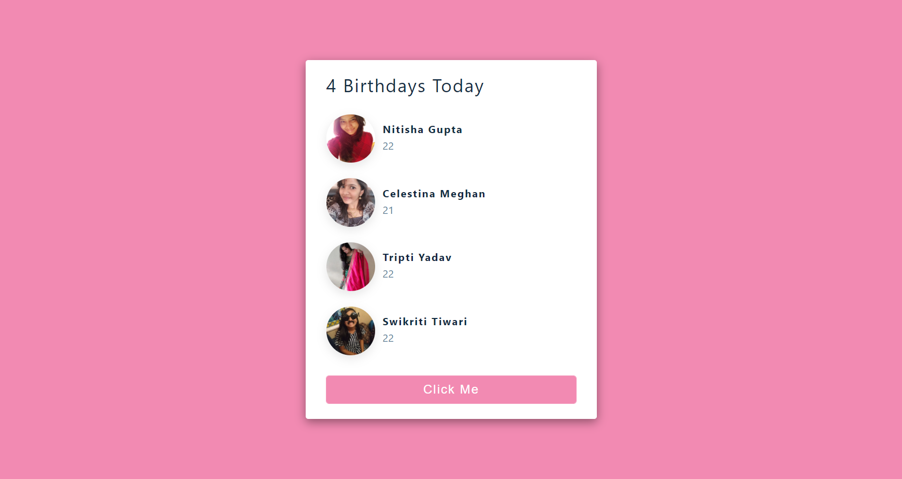
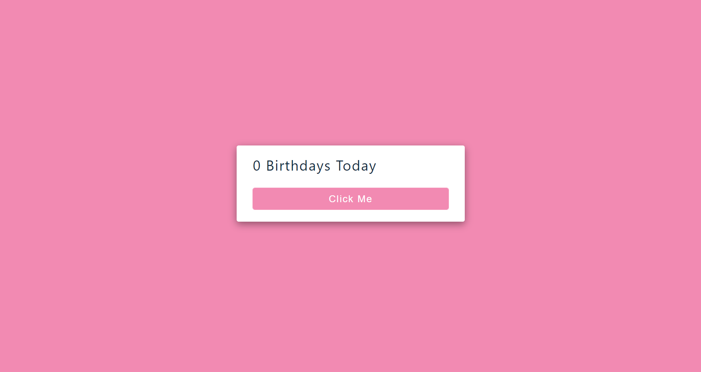

# Birthday Card Project

---

### `#myFirstReactProject`

- Data is written in the form of array in Data.js folder containing id, name, age and image for all entries.

- Destructuring of data is done in List.js folder and then name, age, image, and total number of birthdays is shown in result.

- A button "Click Me" empties the array and "0 birthdays today" is shown on screen. 

